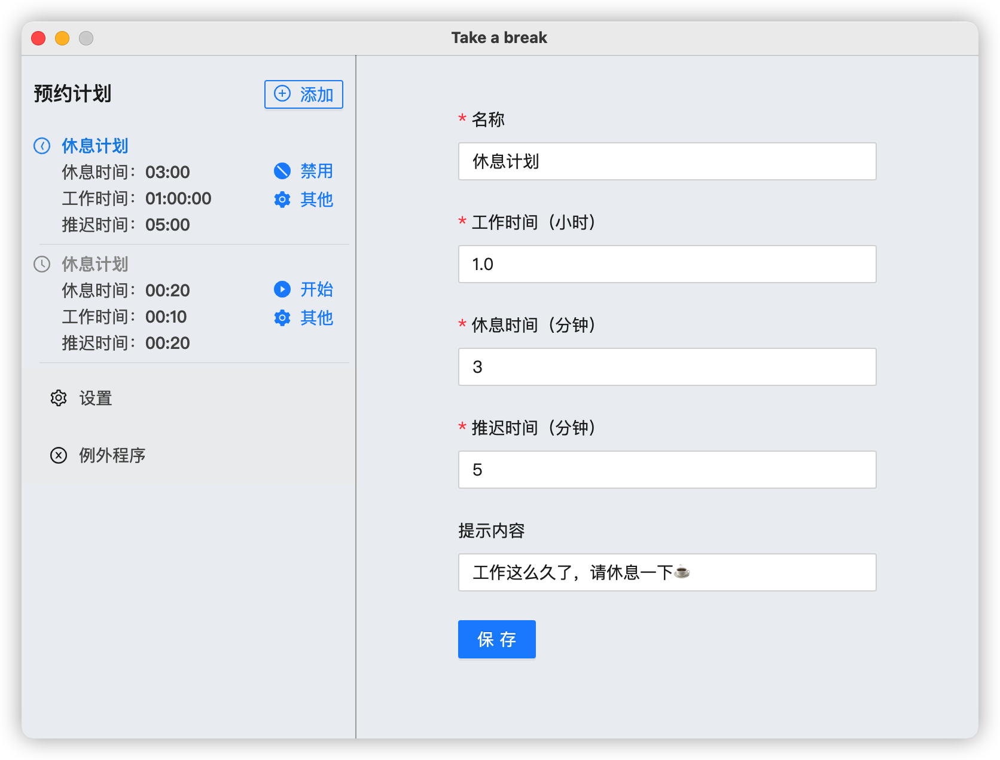
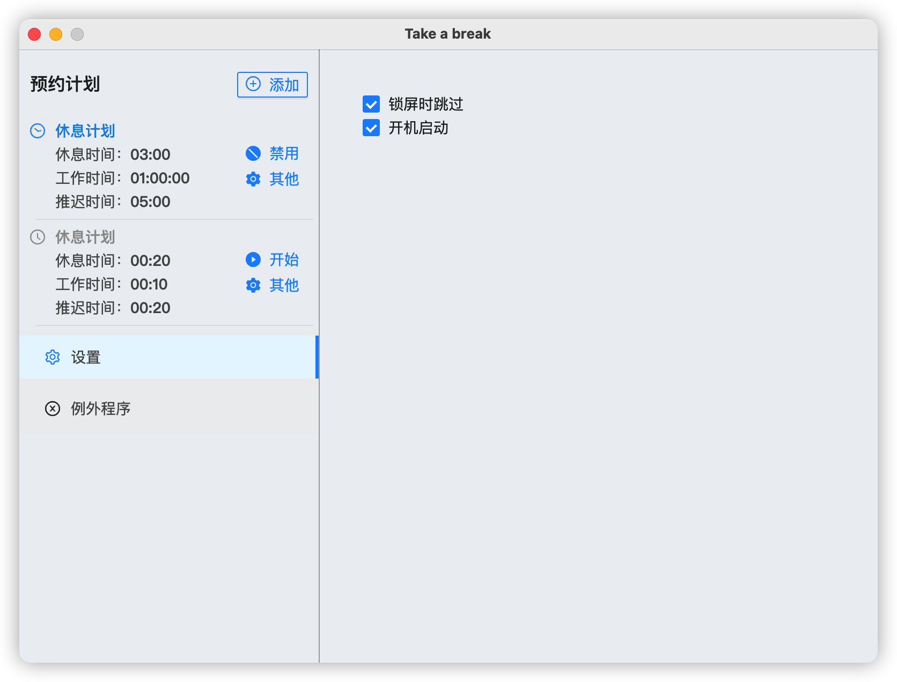
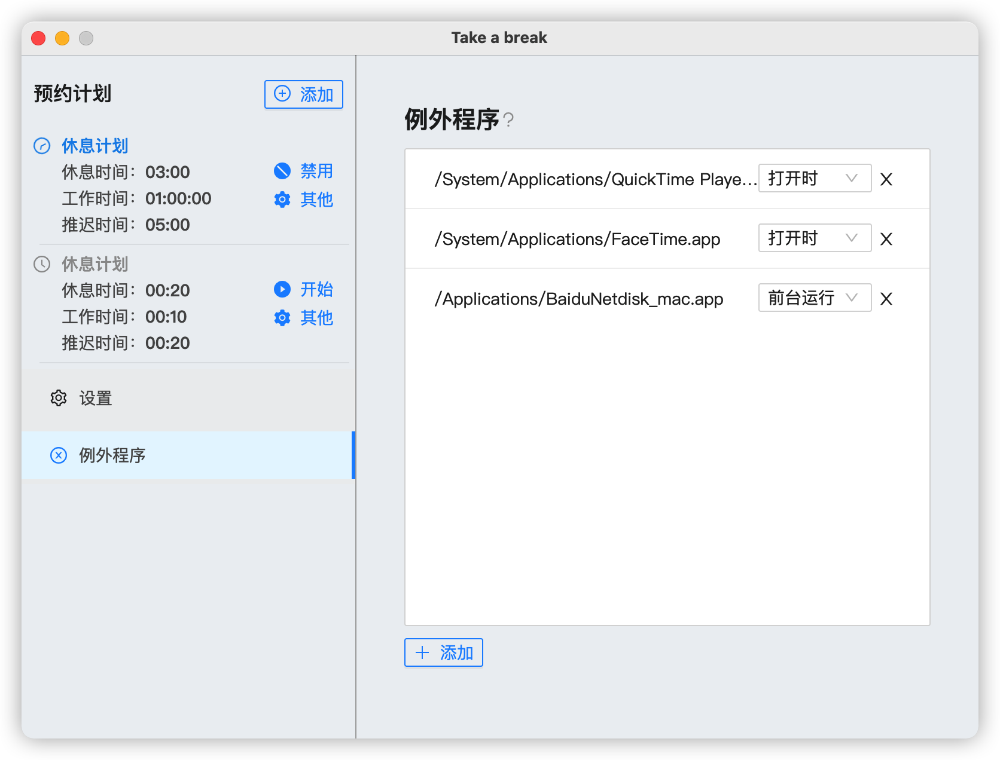

<div align="center">


</div>

# Take a break

An application remind people to have a break after hours hard working on MacOS.
It takes advantage of [Electron React Boilerplate](https://electron-react-boilerplate.js.org/) as the code skeleton.

## Screenshots







## Installation

Go to [release page](https://github.com/neilning-xc/take-a-break/releases) to install latest application, or package it from source code if you would like to.

## Starting Development

Start the app in the `dev` environment:

```bash
yarn
yarn start
```

## Packaging for Production

```bash
yarn package
```

## Maintainers

Neil Ning: ningcorder@foxmail.com

## Contribution

Status flow:


This repository follow the [Conventional Commits Specification](https://conventionalcommits.org), and take advantage of [commitizen](https://github.com/commitizen/cz-cli) to help write the correct commit message, so if you have no commitizen installed on your machine, you have to commit code by running `yarn cm`.

## License

MIT © [Take a break](https://github.com/neilning-xc/take-a-break)
